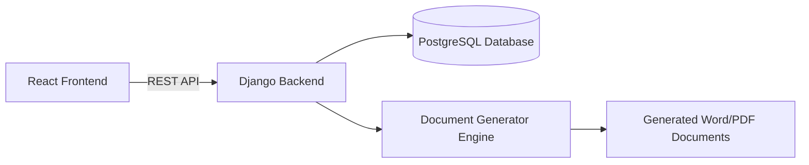
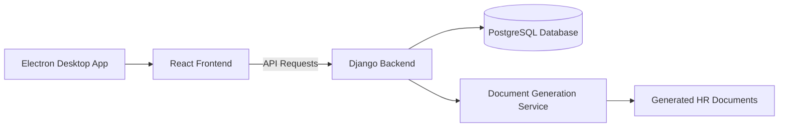

# HR Document Generator

## Overview

**HR Document Generator** is a platform designed to automate the creation of HR documents such as employment certificates, salary attestations, and mission orders.

The system allows HR teams to:

* Generate documents from employee data
* Import employee data from Excel files
* Store document history
* Download generated documents (Word or PDF)

The application is available as:

* A **Web Application**
* A **Desktop Application**

The desktop version uses Electron to package the web application.

---

# Technology Stack

## Backend

* **Python 3.x**
* **Django**
* **PostgreSQL**

### Responsibilities

* Authentication and authorization
* Employee data management
* Document generation
* File management
* REST API for frontend communication

---

## Frontend (Web)

* **React**
* **Material UI**
* **React Icons**

### Responsibilities

* User interface
* Forms for generating HR documents
* Tables displaying document history
* Authentication pages
* API communication with the backend

---

## Desktop Application

* **Electron**

### Responsibilities

* Wrap the React web application into a desktop application
* Provide a native desktop window
* Allow distribution as a standalone executable

---

## Document Generation

Libraries used for document processing:

* **python-docx**
  Used to generate and modify Microsoft Word (.docx) documents from templates.

* **Pandas**
  Used for processing employee data from Excel files.

* **Openpyxl**
  Used to read and write Excel files.

* **Pillow (PIL)**
  Used for handling images and logos in documents.

---

## Cloud & File Handling

* **Requests** library is used to download files from cloud services such as:

  * Google Drive
  * Dropbox

---

# System Architecture

## High-Level Architecture



---

## Desktop Architecture



---

# Project Structure

## Backend (Django)

```
backend/
│
├── hr_documents/
│   ├── models.py
│   ├── views.py
│   ├── serializers.py
│   ├── urls.py
│
├── document_generator/
│   ├── templates/
│   ├── generator.py
│
├── employees/
│   ├── models.py
│   ├── services.py
│
├── manage.py
└── requirements.txt
```

---

## Frontend (React)

```
frontend/
│
├── src/
│   ├── components/
│   ├── pages/
│   │   ├── Login
│   │   ├── Dashboard
│   │   ├── GenerateDocument
│   │   └── History
│   │
│   ├── services/
│   │   └── api.js
│   │
│   ├── hooks/
│   └── App.jsx
│
└── package.json
```

---

## Electron Wrapper

```
desktop/
│
├── main.js
├── preload.js
└── package.json
```

Electron loads the built React application and runs it inside a native desktop window.

---

# Data Flow

### Document Generation Process

1. HR user logs into the system.
2. User selects a document type.
3. User fills in employee information or imports data from Excel.
4. React frontend sends request to Django API.
5. Django processes the request and retrieves employee data.
6. Document generation service fills the Word template.
7. Generated document is stored and returned to the user.
8. Document history is recorded in PostgreSQL.

---

# Deployment Options

## Web Deployment

```
React Build
     │
     ▼
Django API Server
     │
     ▼
PostgreSQL Database
```

---

## Desktop Deployment

```
Electron
   │
   ▼
React Build
   │
   ▼
Django API (Remote Server)
```

---

# Key Features

* Employee management
* HR document generation
* Excel data import
* Document template management
* Document history tracking
* Web interface
* Desktop application support
* Cloud file integration

---

# Future Improvements

* Role-based access control
* Digital signatures
* Automated document emailing
* HR workflow automation
* Integration with HR platforms
* PDF generation pipeline
